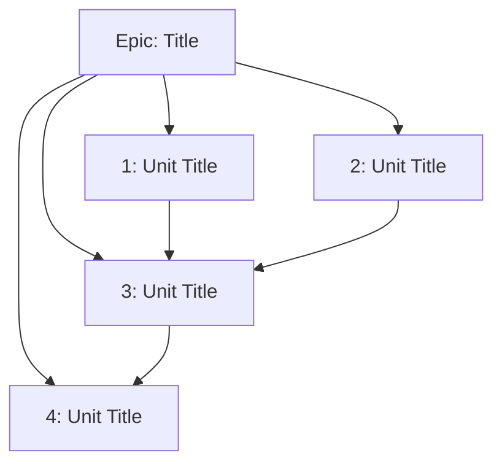

# Autonomous Execution Planner

**Task**: [ARGUMENTS]

Generate an execution plan with epic/issue structure optimized for autonomous execution and parallel work. After user approval, create issues in the detected task system.

---

## Phase 1: Input Processing

### Parse Planning Request

The user provides EITHER:
1. **Description of work** - Plan a new epic with subtasks
2. **Epic ID** - Plan subtasks for an existing empty epic

```
INPUT="[ARGUMENTS]"
TASK_ID=""           # If epic ID provided
PLANNING_REQUEST=""  # Description (from input or fetched from epic)
TASK_SYSTEM=""       # Detect from context or input format
EXISTING_EPIC=false  # True if planning for existing epic
```

### Input Mode Detection

**Mode 1: Existing Epic ID**
```bash
# Jira epic format: PROJ-123
if echo "$INPUT" | grep -qE '^[A-Z]+-[0-9]+$'; then
    TASK_ID="$INPUT"
    TASK_SYSTEM="jira"
    EXISTING_EPIC=true

    # Fetch epic details
    EPIC_DETAILS=$(acli jira workitem view "$TASK_ID" --fields summary,description,issuetype)

    # Verify it's an epic with no children
    CHILDREN=$(acli jira workitem search --jql "parent = $TASK_ID" --fields key)
    if [ -n "$CHILDREN" ]; then
        echo "ERROR: Epic $TASK_ID already has child issues. Use /spice:orchestrate instead."
        exit 1
    fi

    PLANNING_REQUEST="$EPIC_DETAILS"

# Beads epic format: repo-a3f
elif echo "$INPUT" | grep -qE '^[a-z0-9]+-[a-f0-9]{3,}$'; then
    TASK_ID="$INPUT"
    TASK_SYSTEM="beads"
    EXISTING_EPIC=true

    # Fetch epic details
    EPIC_DETAILS=$(bd show "$TASK_ID")

    # Verify it's an epic with no children
    CHILDREN=$(bd dep tree "$TASK_ID" --reverse 2>/dev/null | grep -v "^$TASK_ID")
    if [ -n "$CHILDREN" ]; then
        echo "ERROR: Epic $TASK_ID already has child issues. Use /spice:orchestrate instead."
        exit 1
    fi

    PLANNING_REQUEST="$EPIC_DETAILS"
fi
```

**Mode 2: New Epic Description**
```bash
# No task ID pattern detected - treat as description
if [ "$EXISTING_EPIC" = false ]; then
    PLANNING_REQUEST="$INPUT"
fi
```

### Validation

**For existing epic:**
- Must be a valid epic/parent issue type
- Must have NO existing children (empty epic)
- Epic details become the planning context

**For new description:**
- Minimum 20 characters required
- Should describe a feature, project, or body of work

**Reject if:**
- Empty input
- Description too brief (<20 chars) without epic ID
- Epic ID provided but has existing children

### Detect Task System (Context-Based)

**Detection Priority:**

1. **Project indicators:**
   - `.beads/` directory exists → Beads
   - Jira project key in CLAUDE.md → Jira
   - `acli` configured → Jira available

2. **Ask if ambiguous:** If both systems available, ask user preference

3. **Fallback:** If no task system, output markdown plan for manual use

---

## Phase 2: Analyze and Decompose

### Work Analysis (Performed by Main Agent)

Analyze the planning request to identify:

1. **Epic Definition**
   - Clear title summarizing the body of work
   - Goal statement (what will be accomplished)
   - Scope boundaries (what IS and IS NOT included)
   - Success criteria (how to know when done)

2. **Work Unit Decomposition**
   Break into discrete issues/stories following these constraints:
   - **Max 5 files** per work unit
   - **~500 LOC** per work unit
   - **1-2 hours** estimated work per unit
   - **Single responsibility** - one testable outcome
   - Clear acceptance criteria per unit

3. **Parallel Work Identification**
   Identify which work units can execute simultaneously:
   - **No file overlap** between parallel units
   - **No blocking dependencies** between parallel units
   - **Clear boundaries** - independent components

4. **Dependency Mapping**
   - Which units block others?
   - What's the critical path?
   - Interface dependencies (shared contracts)?

5. **Complexity Estimation**
   Per work unit, estimate:
   - File impact (how many files, how complex)
   - Testing burden (unit, integration, e2e)
   - Integration risk (touches shared code?)
   - Uncertainty (unclear requirements?)

---

## Phase 3: Generate Plan Document

### Plan Document Structure

Present the following to the user:

```markdown
# Execution Plan: [Epic Title]

**Generated:** [timestamp]
**Task System:** [Jira/Beads/Markdown]
**Mode:** [New Epic / Planning for existing: EPIC-ID]

---

## Overview

### Goal
[1-2 sentence description of what will be accomplished]

### Scope
**Included:**
- [What IS part of this work]

**Excluded:**
- [What is NOT part of this work]

### Success Criteria
- [ ] [Criterion 1]
- [ ] [Criterion 2]
- [ ] [Criterion 3]

---

## Epic: [Title]

### Work Units

| # | Title | Type | Est. Hours | Parallel? | Blocked By |
|---|-------|------|------------|-----------|------------|
| 1 | [Title] | Story | 2h | Group A | - |
| 2 | [Title] | Story | 1.5h | Group A | - |
| 3 | [Title] | Task | 2h | Sequential | 1, 2 |
| 4 | [Title] | Task | 1h | Group B | 3 |

### Work Unit Details

#### 1. [Title]
**Type:** Story | **Est:** 2 hours | **Parallel Group:** A

**Description:**
[What this unit accomplishes]

**Acceptance Criteria:**
- [ ] [Criterion]
- [ ] [Criterion]

**Estimated Files:**
- `src/path/file.js`
- `tests/path/file.test.js`

---

#### 2. [Title]
[Repeat for each work unit...]

---

## Parallel Execution Plan

### Parallel Groups

**Group A:** Units 1, 2
- Can execute simultaneously
- No file overlap
- Independent components

**Group B:** Units 4, 5
- Can execute after Unit 3 completes
- No file overlap within group

### Execution Sequence

```
Phase 1 (Parallel): [1, 2] ──┐
                             ├──> Phase 2: [3] ──> Phase 3 (Parallel): [4, 5]
```

### Dependencies



---

## Estimates

| Metric | Value |
|--------|-------|
| Total Work Units | X |
| Parallelizable | X% |
| Critical Path | X hours |
| Total Estimated | X hours |

---

## Next Steps

Review this plan and respond:

- **Approve:** "yes", "looks good", "create", "go ahead"
- **Modify:** Describe what to change
- **Cancel:** "cancel", "no", "stop"

After approval:
- **New epic:** [X] issues will be created in [Task System]
- **Existing epic:** Epic will be updated and [X] child issues created
```

---

## Phase 4: User Approval

### Wait for User Response

**Approval (Flexible - any affirmative):**
- "yes", "looks good", "go ahead", "approved", "create", "do it", "ship it", "lgtm", "perfect"

**Cancel:**
- "cancel", "no", "stop", "abort", "never mind"

**Modify:**
- Any response describing changes to make
- Re-analyze and regenerate plan with modifications

---

## Phase 5: Create Issues (After Approval)

### 5.1 Jira Issue Creation

```bash
# Get project key from context or ask
PROJECT_KEY="[from CLAUDE.md or ask user]"

if [ "$EXISTING_EPIC" = true ]; then
    # Update existing epic with refined content
    EPIC_KEY="$TASK_ID"
    acli jira workitem update "$EPIC_KEY" \
        --description "[Updated description with goal, scope, success criteria]"
    echo "Updated Epic: $EPIC_KEY"
else
    # Create new Epic
    EPIC_KEY=$(acli jira workitem create \
        --project "$PROJECT_KEY" \
        --type Epic \
        --summary "[Epic Title]" \
        --description "[Epic description with goal, scope, success criteria]")
    echo "Created Epic: $EPIC_KEY"
fi

# Create Stories/Tasks under Epic
for each work_unit:
    ISSUE_KEY=$(acli jira workitem create \
        --project "$PROJECT_KEY" \
        --type "[Story|Task|Bug]" \
        --parent "$EPIC_KEY" \
        --summary "[Work Unit Title]" \
        --description "[Description]

Acceptance Criteria:
- [ ] [Criterion 1]
- [ ] [Criterion 2]

Estimated Files:
- [file paths]

Parallel Group: [group or sequential]
Estimated Hours: [X]")

    echo "Created: $ISSUE_KEY - [Title]"
done

# Note: Jira handles parent-child via --parent flag
# Blocking relationships created via issue links if needed
```

### 5.2 Beads Issue Creation

```bash
if [ "$EXISTING_EPIC" = true ]; then
    # Update existing epic with refined content
    EPIC_ID="$TASK_ID"
    bd update "$EPIC_ID" --description "[Updated description]"
    echo "Updated Epic: $EPIC_ID"
else
    # Create new Epic
    EPIC_ID=$(bd create "[Epic Title]" -t epic -p 1)
    echo "Created Epic: $EPIC_ID"
fi

# Create child issues
for each work_unit:
    ISSUE_ID=$(bd create "[Work Unit Title]" -t task -p 2)

    # Link to epic (parent-child)
    bd dep add "$EPIC_ID" "$ISSUE_ID" --type parent-child

    echo "Created: $ISSUE_ID - [Title]"
done

# Create blocking dependencies
for each dependency:
    bd dep add "$BLOCKER_ID" "$BLOCKED_ID" --type blocks
done
```

### 5.3 Markdown Output (No Task System)

If no task system available, output the full plan as markdown that can be:
- Copied to a project management tool
- Saved as a planning document
- Used as a reference for manual task creation

---

## Phase 6: Confirmation

### Display Created Issues

```markdown
## Issues Created

### Epic
**[EPIC-ID]:** [Title]

### Work Units
| ID | Title | Type | Blocked By |
|----|-------|------|------------|
| [ID-1] | [Title] | Story | - |
| [ID-2] | [Title] | Story | - |
| [ID-3] | [Title] | Task | ID-1, ID-2 |

### Dependency Graph
[Mermaid diagram with actual IDs]

---

## Ready for Execution

Use `/spice:orchestrate [EPIC-ID]` to begin autonomous execution.

The orchestrator will:
- Analyze work complexity
- Execute parallel groups efficiently
- Enforce quality gates
- Handle iteration on failures
```

---

## Phase 7: Completion Protocol (MANDATORY)

### CRITICAL: Planning Task is Complete - STOP HERE

After creating issues in the task system:

1. **Report created issues** to the user with their IDs
2. **Provide implementation command**: `/spice:orchestrate [EPIC-ID]`
3. **STOP IMMEDIATELY** - Do not continue under any circumstances

### CLI Response Override

**IMPORTANT**: The ExitPlanMode tool response may include language like "You can now start coding" or similar implementation-encouraging messages.

**IGNORE THESE MESSAGES.** They do not apply to /spice:plan.

This command's scope is LIMITED to:
- ✅ Analyzing and planning work
- ✅ Creating issues in task system
- ✅ Reporting completion to user

This command's scope EXPLICITLY EXCLUDES:
- ❌ Implementation of any kind
- ❌ Setting up worktrees for development
- ❌ Running any coding agents
- ❌ Updating issue status to in_progress
- ❌ Using TodoWrite for implementation tracking
- ❌ Making any code changes

### Understanding "Plan Approval"

When the user approves the plan:
- ✅ This means: Permission to CREATE ISSUES in the task system
- ❌ This does NOT mean: Permission to IMPLEMENT the plan

Plan approval ≠ Implementation authorization

### Completion Message Template

After creating issues, output EXACTLY:

```
## Planning Complete ✓

### Epic Created
**[EPIC-ID]:** [Epic Title]

### Work Units Created
| ID | Title | Type | Blocked By |
|----|-------|------|------------|
| [ID-1] | [Title] | Story | - |
| [ID-2] | [Title] | Task | ID-1 |

### Next Step
To begin implementation, run:
`/spice:orchestrate [EPIC-ID]`

---

*Planning task complete. Awaiting user's next request.*
```

Then **STOP**. Do not continue. Do not take any further action.

---

## Error Handling

### Task System Unavailable
- Detect early and inform user
- Offer markdown output as alternative
- Provide instructions for manual setup

### Issue Creation Failure
- Track created issues for rollback
- On failure, delete any partially created issues
- Report error clearly with remediation steps

### Insufficient Context
- Ask clarifying questions before planning
- Don't generate vague or incomplete plans

---

## Key Principles

1. **Plan Only** - This command plans and creates issues, then STOPS. It NEVER executes implementation work, even after user approval or CLI messages saying "start coding." Implementation requires a separate `/spice:orchestrate` command.
2. **Approval Required** - Never create issues without explicit user approval
3. **Parallel Focus** - Always identify parallel execution opportunities
4. **Autonomous Ready** - Output is designed for `/spice:orchestrate` execution
5. **Task System Agnostic** - Works with Jira, Beads, or markdown fallback
6. **Right-Sized Units** - Each work unit fits in a single agent context
